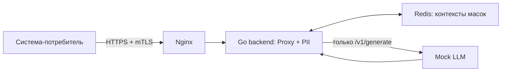

# Схема архитектуры и настройки

AlfaGen находит персональные данные в тексте, маскирует их и хранит
соответствия для последующего восстановления. Основной API — `/process`:
потребитель сам передаёт текст на маскирование и затем маску на восстановление.
Для демонстрации вызова LLM внутри одного запроса предусмотрен `/v1/generate`.

Локальный Docker-стенд устроен так:



Proxy и PII-движок работают в одном процессе. Redis хранит зашифрованные
контексты между запросами и перезапусками backend; в Compose включён AOF.
Срок жизни контекста задаёт `store.ttl` — по умолчанию 30 минут.
Запуск, доступ к админке и пример curl описаны в [README](README.md).

## Два эндпоинта одного конвейера

| | `POST /process` | `POST /v1/generate` |
|---|---|---|
| Роль | Основной API маскирования и восстановления | Демонстрация полной цепочки с LLM |
| Вызывает LLM внутри запроса | Нет | Да (Mock LLM / настраиваемый provider) |
| Направление | Определяется по `payload_id`: новый ID → маскирование, исходник с прежним ID → та же маска, маска с прежним ID → восстановление | Один запрос: текст → маска → provider → демаскированный ответ |
| Runtime-режим | `process_only` и `test_generate` | Только `test_generate` |
| Кто использует | Любой потребитель, которому нужен mask/demask | Демонстрационный клиент полной цепочки с провайдером |

Оба эндпоинта используют `internal/pii/engine.Processor` и общий набор
детекторов. `/process` применяет выбранный системой `mask_mode`;
`/v1/generate` всегда использует непрозрачные токены для безопасной подстановки
в ответ провайдера. Для `/process` третий текст с тем же `payload_id` даёт
HTTP 409; контексты разделены по системе-потребителю.

В [config.example.yaml](config.example.yaml) указан `process_only`:
маршрут `/v1/generate` отсутствует. В локальном
[config.compose.yaml](config.compose.yaml) включён `test_generate` с Mock LLM,
поэтому доступны оба маршрута. `/process` провайдера не вызывает в обоих режимах.

## Настройка систем-потребителей

Каждый потребитель — запись в `systems`. При первом `make admin-up`
скрипт копирует `config.compose.yaml` в `secrets/admin/config/backend.yaml`.
После этого backend читает именно эту рабочую копию; её меняет админ-панель.
Изменения `systems` с новой `version` применяются атомарно без перезапуска.
Ошибочная конфигурация не заменяет последнюю рабочую. Изменения остальных
разделов, включая `default_system`, требуют перезапуска backend.

| Поле | Что определяет |
|---|---|
| `id` | идентификатор системы, передаётся заголовком `X-System-ID` |
| `enabled` | включён ли доступ системы в модуль вообще |
| `api_key` / `api_key_file` | аутентификация системы; `allow_anonymous: true` — явное исключение. В Docker `benchmark` требует ключ из `.env` |
| `detect_types` / `types` | `detect_types` определяет поиск, `types` — прежнюю настройку маскирования; отсутствие/пустой `types` означает все зарегистрированные типы, для отключения поиска задают `detect_types: []` и `mask_types: []` вместе |
| `mask_types` | типы, которые реально маскируются; список должен входить в `detect_types`, если поиск ограничен. Пустой `mask_types: []` отключает маскирование |
| `mask_mode` | `format` (сохраняет формат значения, например `45** ****56`) или `token` (непрозрачный маркер, например `<PASSPORT_NUMBER_…_0>`, где вместо многоточия — криптографический тег) |
| `allow_demask` | разрешено ли системе получить исходный текст обратно |
| `detection_profile` | `balanced` (по умолчанию), `conservative` (только high-confidence срабатывания) или `strict` (принудительные непрозрачные токены) |
| `rules` | условное маскирование: тип маскируется только вместе с другим типом (пример из `config.example.yaml`: `card_pin` маскируется только при наличии `card_number` в том же тексте) |

`config.example.yaml` содержит пять примеров: анонимный `benchmark`,
авторизованный `internal`, `read_only` без демаскирования, `disabled_system`
и `conditional` с условным маскированием PIN. Все, кроме `benchmark`,
первоначально выключены. Это отдельный пример конфигурации.

В Docker изначально настроен один `benchmark` с API-ключом; Nginx также
требует клиентский сертификат. Новые системы добавляются через админку
или рабочий `backend.yaml`, без перекомпиляции.

### Пример правила маскирования

Этот фрагмент добавляется внутрь существующей записи в `systems`,
сохраняя её `id`, ключ и остальные настройки:

```yaml
detect_types: [card_number, card_pin, email]
mask_types: [card_number, card_pin, email]
mask_mode: token
allow_demask: true
rules:
  - type: card_pin
    requires: [card_number]
```

Поиск ограничен тремя категориями. Номер карты и email маскируются всегда
при обнаружении; PIN — только если в том же тексте обнаружен номер карты.
Если в `requires` несколько типов, должны присутствовать все. Условие
проверяется на уровне всего текста, а не только соседних слов.
После ручного редактирования нужно также изменить верхнеуровневую `version`.

## Расширение списка типов ПД через конфиг

Верхнеуровневая секция `custom_pii_types` (вне `systems`) добавляет новую
категорию ПД сразу для всех систем — регулярное выражение плюс уровень
уверенности, без нового `.go`-файла:

```yaml
custom_pii_types:
  - type: employee_badge          # новый PIIType, snake_case
    pattern: '(?i)таб\.\s*номер\s*[:\-]?\s*\d{6}'
    confidence: high               # low | medium | high
```

`config.example.yaml` включает этот пример табельного номера.
В Docker его нужно добавить в рабочий `secrets/admin/config/backend.yaml`
и перезапустить backend. Новый тип ведёт себя как встроенный
при валидации конфигурации, поиске всех типов по умолчанию и применении
политики системы. Допустимый набор типов определяется зарегистрированными
детекторами. Маскирование без
специальной стратегии скрывает буквы и цифры, сохраняя разделители;
`mask_mode: token` даёт маркер с криптографическим тегом; секретный nonce
в тексте маркера не раскрывается. Изменение `custom_pii_types` требует
перезапуска процесса (regex-реестр строится при старте); разрешения систем
на уже зарегистрированные типы обновляются горячей перезагрузкой.

## Добавление нового детектора в коде

Для случаев, где одного regex в конфиге недостаточно (нужна более сложная
логика или анализ контекста), новый тип добавляется как обычный Go-детектор
через интерфейс `Detector` ([internal/pii/pii.go](internal/pii/pii.go)):

```go
type Detector interface {
    Type() PIIType
    Detect(input string) []Finding
}
```

Детектор — чистая функция: получает строку, возвращает найденные фрагменты
(`Finding` с байтовыми смещениями и уровнем уверенности) и не модифицирует
исходный текст. Минимальный пример в кодовой базе —
`internal/pii/detectors/email.go`: детектор компилирует regex через общий
безопасный хелпер `compilePattern` (тот же, что используют
`custom_pii_types`), находит совпадения и на каждое возвращает
`Finding{Type: pii.TypeEmail, Start, End, Confidence, Detector: "email", Value: candidate}`.

Порядок добавления нового типа:

1. Добавить константу `PIIType` и внести её в `AllTypes` — `internal/pii/pii.go`.
2. Реализовать `Detector` в отдельном файле пакета `internal/pii/detectors/`
   (по образцу `email.go` или любого соседнего файла). Если один детектор
   находит несколько связанных типов сразу (например, дату рождения и дату
   выдачи документа), дополнительно реализуется `Types() []PIIType`.
3. Зарегистрировать детектор в списке `All()`, `internal/pii/detectors/all.go`.
   Порядок в списке важен при пересечении спанов: более специфичный
   детектор регистрируется раньше более общего (`card_holder` стоит перед
   `full_name`, чтобы держатель карты не подхватывался как обычное ФИО).
4. При необходимости добавить стратегию маскирования в
   `internal/pii/masking/transform.go` (карта `strategies map[pii.PIIType]Strategy`).
   Не обязательно: без специальной стратегии действует поведение по
   умолчанию — буквы и цифры скрываются, разделители сохраняются.
5. Для контекстно-зависимой логики (например, отличить адрес отделения
   банка от личного адреса клиента по соседним словам) используется
   интерфейс `CandidateDetector` в `internal/pii/pii.go`
   и разрешение контекста в `internal/pii/context.go`.

Отдельного plugin-реестра с динамической загрузкой нет — это ограничение
текущей версии (см. [ограничения и план развития](LIMITATIONS_AND_ROADMAP.md)). Сам путь добавления нового встроенного типа при
этом короткий и одинаковый для всех 17 существующих категорий.

## Полный список поддерживаемых типов ПД

Модуль находит и маскирует 17 встроенных категорий (`internal/pii/pii.go`,
`AllTypes`):

| # | Тип | Значение |
|---|---|---|
| 1 | `full_name` | ФИО |
| 2 | `date_of_birth` | дата рождения |
| 3 | `place_of_birth` | место рождения |
| 4 | `passport_number` | номер паспорта |
| 5 | `citizenship` | гражданство |
| 6 | `passport_issuer` | орган, выдавший паспорт |
| 7 | `passport_division_code` | код подразделения паспорта |
| 8 | `passport_issue_date` | дата выдачи паспорта |
| 9 | `driver_license` | водительское удостоверение |
| 10 | `address` | адрес |
| 11 | `email` | email |
| 12 | `phone` | телефон |
| 13 | `inn` | ИНН |
| 14 | `card_number` | номер банковской карты |
| 15 | `cvv` | CVV/CVC карты |
| 16 | `card_pin` | PIN-код карты |
| 17 | `card_holder` | держатель карты |

Поверх этого списка через `custom_pii_types` добавляются произвольные
дополнительные категории без изменения кода (см. выше) — 17 встроенных
типов не предел, а стартовый набор.

## Админ-панель и мониторинг

Админ-панель управляет системами, ключами, сертификатами и нагрузочным
генератором, предоставляет ручную проверку и журнал действий.
Prometheus собирает метрики backend; Grafana показывает дашборды
«AlfaGen · Операции» и «AlfaGen Logs». Loki хранит логи, Alloy собирает
бизнес-события backend и админки только текущего Compose-проекта.

p50 в «Операциях» рассчитывается по логам PII-модуля. HTTP latency из
нагрузочного отчёта измеряет более широкий путь запроса; эти показатели
имеют разный смысл. Оценочный TPS использует число UTF-8 байт / 4.

## Где смотреть дальше

- [Локальный запуск и curl](README.md).
- [Конфигурация Docker-стенда](config.compose.yaml).
- [Примеры систем и пользовательских типов](config.example.yaml).
- [HTTP API](api/openapi.yaml).
- [Производительность и дополнительные возможности](PERFORMANCE_AND_FEATURES.md).
- [Ограничения решения и план развития](LIMITATIONS_AND_ROADMAP.md).
